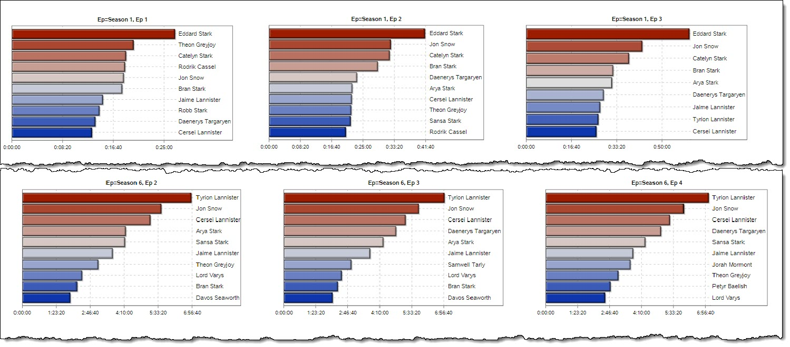

# Visualization of screen time

Inspired [by this tweet](https://twitter.com/katie_jean2379/status/1118714039356592128), I built this sample program in SAS.

Special thanks to Jeffry Lancaster [for sharing the original data and visualization](https://github.com/jeffreylancaster/game-of-thrones).  
Using PROC HTTP and the JSON libname engine, SAS can ingest the data directly with just a few lines of code.

From there, it's data prep (of course) and then the visualization steps.  See code comments for the details.

Sample grid of Episode-by-episode numbers:

And the final animation (GIF here, but program produces an SVG).

